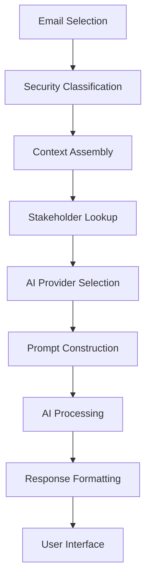

# Outlook Email AI Assistant - Developer Support Guide

## 🔧 Development Environment

### Prerequisites
- **Node.js**: 18.x or later
- **npm**: 8.x or later
- **TypeScript**: 4.x or later
- **Visual Studio Code**: Recommended IDE
- **Office.js Development Tools**: For testing and debugging

### Quick Start
```bash
# Clone and setup
git clone <repository-url>
cd outlook_email_assistant
npm install

# Install development certificates
.\install-dev-cert.ps1

# Start development server
npm start

# In another terminal, sideload the add-in
.\sideload-addin.ps1
```

## 🏗️ Architecture Deep Dive

### Project Structure
```
outlook_email_assistant/
├── src/
│   ├── components/          # React UI components
│   │   ├── TaskPaneContainer.tsx    # Main application container
│   │   └── SettingsPanel.tsx        # Configuration interface
│   ├── services/           # Business logic layer
│   │   ├── providers/      # AI provider implementations
│   │   │   ├── BaseAIProvider.ts    # Abstract base class
│   │   │   ├── OpenAIProvider.ts    # OpenAI integration
│   │   │   └── OllamaProvider.ts    # Ollama integration
│   │   ├── AIProviderManager.ts     # Provider orchestration
│   │   ├── UserPreferenceManager.ts # Settings persistence
│   │   ├── SecurityClassificationService.ts # Content security
│   │   └── EnterpriseStorageService.ts # Data management
│   ├── types/              # TypeScript definitions
│   │   └── index.ts        # Core type definitions
│   └── index.tsx           # Application entry point
├── public/
│   ├── manifest.xml        # Office add-in manifest
│   ├── assets/            # Static assets
│   └── commands.html      # Office commands page
├── dist/                  # Build output (generated)
└── docs/                  # Documentation
```

### Core Design Patterns

#### Provider Pattern (AI Abstraction)
```typescript
// All AI providers implement this interface
export interface AIProvider {
  type: 'openai' | 'ollama';
  name: string;
  isHealthy(): Promise<boolean>;
  generateResponse(prompt: string, context: EmailSelectionContext): Promise<string>;
  analyzeEmail(email: EmailSelectionContext): Promise<EmailAnalysis>;
}

// Easy to extend with new providers
class AnthropicProvider extends BaseAIProvider {
  type = 'anthropic' as const;
  // Implementation...
}
```

#### Context Building Pattern
```typescript
// Extensible context system
interface EmailSelectionContext {
  id: string;
  subject: string;
  body: string;
  sender: ContactInfo;
  recipients: Recipients;
  attachments: AttachmentInfo[];
  metadata: EmailMetadata;
  classification?: SecurityClassification;
}
```

### Data Flow Architecture



## 🧩 Component Details

### TaskPaneContainer.tsx
**Purpose**: Main application state and UI orchestration
**Key Features**:
- Email content loading and management
- AI provider state management
- User interaction handling
- Error boundary and loading states

**State Management**:
```typescript
const [emailContent, setEmailContent] = useState<EmailContext | null>(null);
const [analysisResult, setAnalysisResult] = useState<string>('');
const [generatedDraft, setGeneratedDraft] = useState<string>('');
const [isProcessing, setIsProcessing] = useState<boolean>(false);
```

### AIProviderManager.ts
**Purpose**: Multi-provider orchestration and health monitoring
**Key Features**:
- Provider discovery and initialization
- Health check automation
- Failover and load balancing
- Performance monitoring

**Provider Management**:
```typescript
class AIProviderManager {
  private providers = new Map<string, AIProvider>();
  private healthStatus = new Map<string, boolean>();
  
  async getHealthyProvider(): Promise<AIProvider> {
    // Returns best available provider
  }
}
```

### UserPreferenceManager.ts
**Purpose**: Secure, persistent configuration management
**Key Features**:
- Encrypted storage using AES
- Office.js roaming settings integration
- Fallback to localStorage
- Version migration support

**Security Features**:
```typescript
private static encryptData(data: string): string {
  return CryptoJS.AES.encrypt(data, this.ENCRYPTION_KEY).toString();
}

private static decryptData(encryptedData: string): string {
  const bytes = CryptoJS.AES.decrypt(encryptedData, this.ENCRYPTION_KEY);
  return bytes.toString(CryptoJS.enc.Utf8);
}
```

## 🔌 Extending the System

### Adding New AI Providers

1. **Create Provider Class**:
```typescript
export class NewAIProvider extends BaseAIProvider {
  public type = 'newai' as const;
  public name = 'New AI Service';
  
  protected getAuthHeaders(): Record<string, string> {
    return { 'Authorization': `Bearer ${this.apiKey}` };
  }
  
  public async generateResponse(prompt: string, context: EmailSelectionContext): Promise<string> {
    // Implementation
  }
  
  public async analyzeEmail(email: EmailSelectionContext): Promise<EmailAnalysis> {
    // Implementation
  }
}
```

2. **Update Type Definitions**:
```typescript
// In types/index.ts
export interface UserPreferences {
  providerPreferences: {
    defaultProvider: 'openai' | 'ollama' | 'newai';
    newai: {
      apiKey: string;
      model: string;
      baseUrl: string;
    };
  };
}
```

3. **Register Provider**:
```typescript
// In AIProviderManager.ts
initializeProviders(preferences: UserPreferences) {
  // Add new provider registration
  if (preferences.providerPreferences.newai.apiKey) {
    const newaiProvider = new NewAIProvider({
      baseUrl: preferences.providerPreferences.newai.baseUrl,
      apiKey: preferences.providerPreferences.newai.apiKey,
      defaultModel: preferences.providerPreferences.newai.model
    });
    this.providers.set('newai', newaiProvider);
  }
}
```

### Adding New Features

#### Email Analysis Enhancements
```typescript
// Extend EmailAnalysis interface
export interface EmailAnalysis {
  // Existing fields...
  sentiment: SentimentAnalysis;
  entities: EntityExtraction;
  compliance: ComplianceCheck;
  // New fields...
}

// Implement in provider
public async analyzeEmail(email: EmailSelectionContext): Promise<EmailAnalysis> {
  const baseAnalysis = await super.analyzeEmail(email);
  
  // Add new analysis capabilities
  const sentiment = await this.analyzeSentiment(email.body);
  const entities = await this.extractEntities(email.body);
  
  return {
    ...baseAnalysis,
    sentiment,
    entities
  };
}
```

#### UI Component Extensions
```typescript
// Add new settings section
const NewFeatureSettings: React.FC = () => {
  return (
    <div className="settings-section">
      <h3>New Feature Configuration</h3>
      {/* Configuration UI */}
    </div>
  );
};

// Include in SettingsPanel.tsx
```

## 🧪 Testing Strategy

### Unit Testing
```bash
# Install testing dependencies
npm install --save-dev jest @testing-library/react @testing-library/jest-dom

# Run tests
npm test
```

### Testing AI Providers
```typescript
describe('OllamaProvider', () => {
  it('should generate response', async () => {
    const provider = new OllamaProvider(config);
    const response = await provider.generateResponse(prompt, context, userPrefs);
    expect(response).toBeDefined();
    expect(response.length).toBeGreaterThan(0);
  });
});
```

### Integration Testing
```typescript
describe('Email Analysis Integration', () => {
  it('should classify and analyze email', async () => {
    const email = createTestEmail();
    const classification = SecurityClassificationService.analyzeEmailClassification(email);
    
    if (classification.isProcessingAllowed) {
      const analysis = await provider.analyzeEmail(email, userPrefs);
      expect(analysis.summary.keyPoints).toBeDefined();
    }
  });
});
```

## 🐛 Debugging

### Development Tools
- **Browser DevTools**: Inspect add-in iframe
- **Office.js Logging**: Enable verbose logging
- **Network Tab**: Monitor API calls
- **Console Logging**: Comprehensive debug output

### Common Debugging Scenarios

#### Office.js Issues
```javascript
// Check Office.js availability
if (typeof Office !== 'undefined') {
  console.log('Office.js version:', Office.context.displayLanguage);
} else {
  console.error('Office.js not available');
}

// Monitor Office.js events
Office.onReady((info) => {
  console.log('Office.js ready:', info);
});
```

#### AI Provider Debugging
```typescript
// Enable debug logging
const provider = new OllamaProvider({
  baseUrl: 'http://localhost:11434',
  defaultModel: 'llama3.2',
  debug: true  // Enable verbose logging
});

// Test connectivity
const health = await provider.testConnectivity();
console.log('Provider health:', health);
```

### Performance Profiling
```typescript
// Measure AI response times
const startTime = performance.now();
const response = await provider.generateResponse(prompt, context, userPrefs);
const endTime = performance.now();
console.log(`AI response time: ${endTime - startTime}ms`);

// Memory usage monitoring
const memoryUsage = (performance as any).memory;
if (memoryUsage) {
  console.log('Memory usage:', {
    used: memoryUsage.usedJSHeapSize,
    total: memoryUsage.totalJSHeapSize,
    limit: memoryUsage.jsHeapSizeLimit
  });
}
```

## 🔐 Security Considerations

### Input Validation
```typescript
// Sanitize email content
function sanitizeEmailContent(content: string): string {
  // Remove potentially harmful content
  return content
    .replace(/<script[^>]*>.*?<\/script>/gi, '')
    .replace(/javascript:/gi, '')
    .trim();
}
```

### API Security
```typescript
// Secure API configuration
class SecureAIProvider extends BaseAIProvider {
  protected getAuthHeaders(): Record<string, string> {
    return {
      'Authorization': `Bearer ${this.apiKey}`,
      'X-API-Version': '2024-01-01',
      'User-Agent': 'OutlookEmailAssistant/1.0'
    };
  }
  
  protected async makeRequest(endpoint: string, options: RequestInit): Promise<Response> {
    // Add rate limiting, retry logic, etc.
    return super.makeRequest(endpoint, {
      ...options,
      timeout: 30000,
      headers: {
        ...options.headers,
        'Content-Type': 'application/json'
      }
    });
  }
}
```

## 📦 Build & Deployment

### Development Build
```bash
npm run build:dev
```

### Production Build
```bash
npm run build
```

### Custom Build Configurations
```javascript
// webpack.config.js customization
module.exports = {
  // Base configuration
  mode: process.env.NODE_ENV === 'production' ? 'production' : 'development',
  
  // Environment-specific settings
  plugins: [
    new webpack.DefinePlugin({
      'process.env.AI_PROVIDER_URL': JSON.stringify(process.env.AI_PROVIDER_URL),
      'process.env.ENABLE_DEBUG': JSON.stringify(process.env.ENABLE_DEBUG === 'true')
    })
  ]
};
```

## 🔄 CI/CD Pipeline

### GitHub Actions Example
```yaml
name: Build and Deploy
on:
  push:
    branches: [main]

jobs:
  build:
    runs-on: ubuntu-latest
    steps:
      - uses: actions/checkout@v3
      - uses: actions/setup-node@v3
        with:
          node-version: '18'
      - run: npm ci
      - run: npm run build
      - run: npm test
      
  deploy:
    needs: build
    runs-on: ubuntu-latest
    if: github.ref == 'refs/heads/main'
    steps:
      - name: Deploy to production
        run: |
          # Deployment steps
```

## 📚 Resources

### Documentation
- [Office.js API Reference](https://docs.microsoft.com/en-us/office/dev/add-ins/)
- [TypeScript Handbook](https://www.typescriptlang.org/docs/)
- [React Documentation](https://reactjs.org/docs/)

### Tools
- [Office Add-in Validator](https://github.com/OfficeDev/office-addin-validator)
- [Yeoman Office Generator](https://github.com/OfficeDev/generator-office)
- [Office.js Debugging Tools](https://github.com/OfficeDev/office-addin-debugging)

---

**For operational procedures, see [OPERATIONAL_SUPPORT.md](OPERATIONAL_SUPPORT.md)**

## Add-in Sideloading Guide

#### Quick Start

1. **Start the development server**:
   ```bash
   npm run dev
   ```

2. **Install SSL certificates** (if not already done):
   ```bash
   npm run install-certs
   ```

3. **Verify everything is working**:
   ```bash
   npm run sideload
   ```

#### Sideloading Methods

**Method 1: Desktop Outlook (Recommended)**

1. **Open Microsoft Outlook Desktop**
2. **Navigate to Add-ins**:
   - Go to **File** > **Manage Add-ins**
   - Or use the **Get Add-ins** button in the ribbon
3. **Add Custom Add-in**:
   - Click **My add-ins**
   - Select **Developer add-ins**
   - Click **Add a custom add-in**
   - Choose **Add from URL**
4. **Enter the manifest URL**:
   ```
   https://localhost:3001/manifest.xml
   ```
5. **Install**: Click **Install** to complete the process

**Method 2: Outlook Web App**

1. **Open Outlook Web App**:
   - Go to [https://outlook.live.com](https://outlook.live.com) or [https://outlook.office.com](https://outlook.office.com)
2. **Access Settings**:
   - Click the gear icon (Settings)
   - Select **View all Outlook settings**
3. **Navigate to Add-ins**:
   - Go to **General** > **Manage add-ins**
4. **Add Custom Add-in**:
   - Click **Add a custom add-in**
   - Select **Add from URL**
5. **Enter the manifest URL**:
   ```
   https://localhost:3001/manifest.xml
   ```
6. **Install**: Follow the prompts to complete installation

**Method 3: Office 365 Admin Center (Enterprise)**

For enterprise deployments, IT administrators can:

1. **Access Admin Center**:
   - Go to [https://admin.microsoft.com](https://admin.microsoft.com)
2. **Navigate to Add-ins**:
   - Settings > Services & add-ins > Office add-ins
3. **Deploy Add-in**:
   - Click **Deploy Add-in**
   - Select **Upload from URL**
   - Enter the manifest URL

#### Using the Add-in

Once sideloaded, the add-in will appear:

1. **In the Ribbon**: Look for the "AI Assistant" group
2. **Task Pane**: Click "Open AI Assistant" to launch
3. **Settings**: Use the gear icon to configure AI providers

#### Sideloading Troubleshooting

**Common Issues**

- **"Could not load" Error**
  - **Cause**: SSL certificate or network connectivity issues
  - **Solution**: Run `npm run install-certs` and restart Outlook

- **"Manifest not found" Error**
  - **Cause**: Development server not running or wrong URL
  - **Solution**: 
    - Ensure server is running: `npm run dev`
    - Verify URL: `https://localhost:3001/manifest.xml`

- **Add-in not appearing**
  - **Cause**: Sideloading didn't complete properly
  - **Solution**: 
    - Remove the add-in from Outlook
    - Clear browser cache
    - Try sideloading again

**Debug Steps**

1. **Check server status**:
   ```bash
   curl -k https://localhost:3001
   ```

2. **Verify manifest**:
   ```bash
   curl -k https://localhost:3001/manifest.xml
   ```

3. **Check browser console**:
   - Open Developer Tools (F12)
   - Look for JavaScript errors
   - Check Network tab for failed requests

4. **Verify certificates**:
   ```bash
   npm run verify-certs
   ```

#### Development Workflow

1. **Start Development**:
   ```bash
   npm run dev
   ```

2. **Make Changes**: Edit source files in `src/`

3. **Hot Reload**: Changes automatically reflected in Outlook

4. **Build Production**:
   ```bash
   npm run build
   ```

5. **Deploy**: Follow deployment guide for production

#### Security Notes

- Development certificates are only for local development
- Never use development certificates in production
- Always use HTTPS for Office Add-ins
- Keep API keys secure and never commit them to version control
